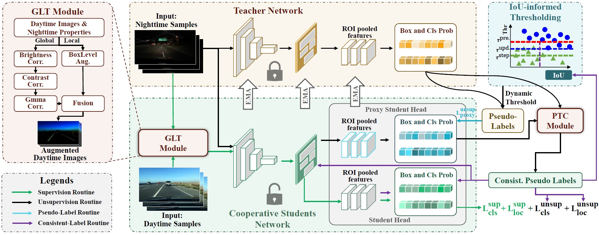

# Cooperative-Students: Navigating Unsupervised Domain Adaptation in Nighttime Object Detection

Official implementation of **Cooperative-Students: Navigating Unsupervised Domain Adaptation in Nighttime Object Detection**.
<p align="center">

</p>

# Installation

## Prerequisites

- Python ≥ 3.6

- PyTorch ≥ 1.5 and torchvision that matches the PyTorch installation.

- Detectron2 \=\= 0.6 (The version I used to run my code)

## Our tested environment

- 2 Nvidia A40 (2 \* 9 batch size)

## Install python env

To install required dependencies on the virtual environment of the python (e.g., virtualenv for python3), please run the following command at the root of this code:

    $ python3 -m venv /path/to/new/virtual/environment/.
    $ source /path/to/new/virtual/environment/bin/activate

For example:

    $ mkdir python_env
    $ python3 -m venv python_env/
    $ source python_env/bin/activate

## Build Detectron2 from Source

Follow the [INSTALL.md](https://github.com/facebookresearch/detectron2/blob/master/INSTALL.md) to install Detectron2.

## Dataset download

1.  Download the datasets

    | **Dataset** | **URL**                                 | **Num of Classes** | **Daytime** | **Nighttime (UDA)** | **Nighttime (Eval)** |
    | ----------- | --------------------------------------- | ------------------ | ----------- | ------------------- | -------------------- |
    | BDD100K     | [Link](https://www.vis.xyz/bdd100k/)    | 10                 | 36,728      | 32,998              | 4,707                |
    | SHIFT       | [Link](https://www.vis.xyz/shift/)      | 6                  | 19,452      | 8,497               | 1,200                |
    | ACDC        | [Link](https://acdc.vision.ee.ethz.ch/) | 8                  | 1,200       | 400                 | 400                  |

2.  Organize the dataset in COCO format following:

```shell
cos/
└── data/
    └── bdd100k/
        └── images/
            ├── train/
            └── val/
        ├── train_day.json
        └── train_night.json
        └── val_night.json
   └── shift/
        └── images/
            ├── train/
            └── val/
        ├── train_day.json
        └── train_night.json
        └── val_night.json
   └── ACDC/
        ├── rgb_anon/
        └── instancesonly_day_train_gt_detection_continue.json
        └── instancesonly_night_train_gt_detection_continue.json
        └── instancesonly_night_val_gt_detection_continue.json

```

# Training

- Train the Cooperative Students from daytime to nighttime using BDD100K

```shell
python train_net.py \
      --num-gpus 2 \
      --config configs/faster_rcnn_R50_BDD.yaml \
      OUTPUT_DIR output/bdd100k
```

- Train the Cooperative Students from daytime to nighttime using SHIFT

<!---->

    python train_net.py \
          --num-gpus 2 \
          --config configs/faster_rcnn_R50_SHIFT.yaml \
          OUTPUT_DIR output/shift

## Resume the training

```shell
python train_net.py \
      --resume \
      --num-gpus 2 \
      --config configs/faster_rcnn_R50_BDD.yaml MODEL.WEIGHTS <your weight>.pth
```

## Evaluation

```shell
python train_net.py \
      --eval-only \
      --num-gpus 2 \
      --config configs/faster_rcnn_R50_BDD.yaml \
      MODEL.WEIGHTS <your weight>.pth
```


## Citation

```
@article{yuan2024cos,
  title={Cooperative Students: Navigating Unsupervised Domain Adaptation in Nighttime Object Detection},
  author={Jicheng, Yuan and Anh, Le-Tuan and Manfred, Hauswirth and Danh, Le-Phuoc},
  journal={2024 IEEE International Conference on Multimedia and Expo (ICME)},
  year={2024}
}
```
